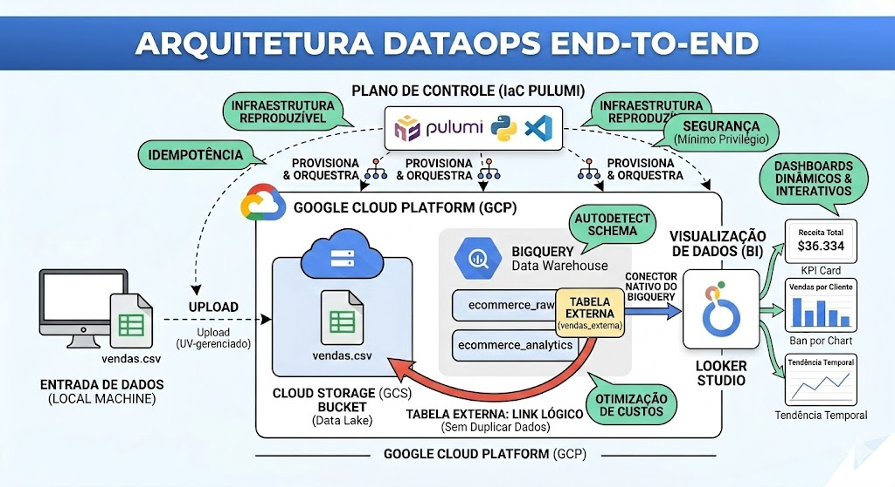
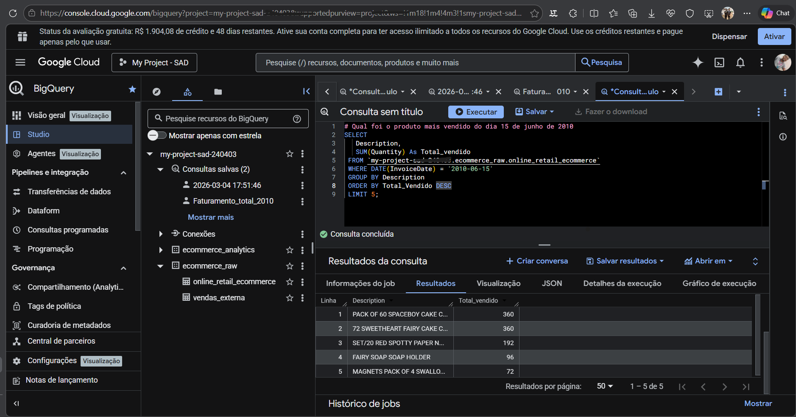
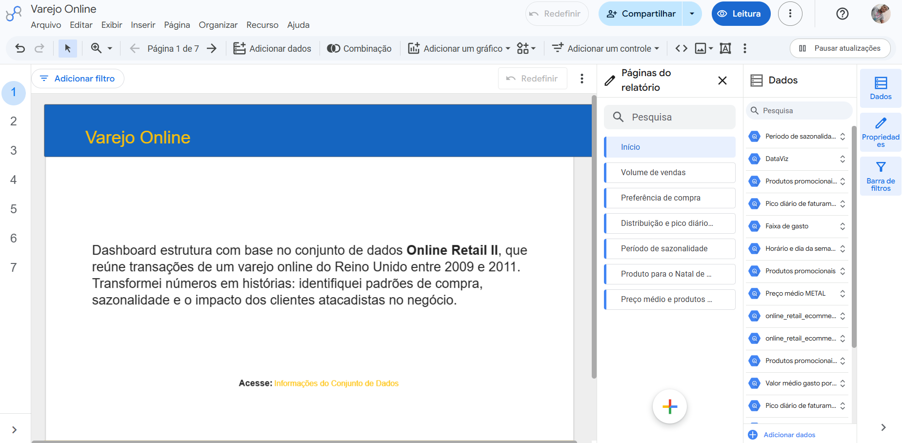
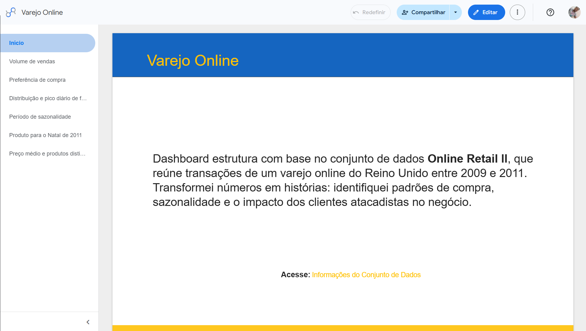

# Arquitetura DataOps: Pipeline GCP, Pulumi, BigQuery & Looker Studio

Tornar os dados acessíveis e acionáveis para as partes interessadas.

**O Conceito do Projeto: Pipeline de Análise de E-commerce com Qualidade de Dados**

**Objetivo:** Criar um pipeline automatizado que ingere dados brutos, transforma em modelos analíticos no BigQuery e garante a qualidade dos dados (DataOps), com toda a infraestrutura na nuvem gerenciada via código.

Esse infográfico resume perfeitamente a jornada completa do dado, desde a sua origem até a tela do diretor da empresa. É exatamente essa visão macro que recrutadores procuram em um Engenheiro de Dados.

Essa arquitetura e o fluxo está dividido em 4 pilares principais: 

1. O "Cérebro" da Operação (Plano de Controle / Pulumi)

2. A Ingestão e o Data Lake (Cloud Storage)

3. O Data Warehouse e a "Mágica" da Tabela Externa

4. A Visualização e Entrega de Valor (Looker Studio)

_____

## Utilizando o BigQuery

**Algumas consulta com o BigQuery**

**Modelagem e provisionamento de bucket de armazenamento no Google Cloud Platform (GCP) com Pulumi (Infrastructure as Code em Python), utilizando o BigQuery e salvando as consultas para a visualização no **Looker Studio**.

**Painel Varejo Online - Tela de Edição**

**Painel Varejo Online - Tela de Leitura**

**Acesso ao Painel:**
[Varejo Online](https://datastudio.google.com/reporting/4084891a-f0f9-4e8d-b1cb-7d933cfa57dd)